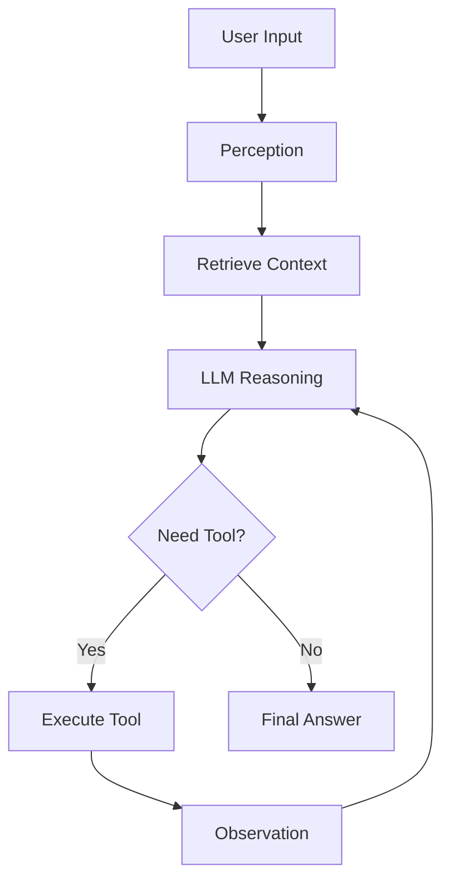

# Agent Architecture Overview

> **The Cognitive Loop** - Perception, Planning, Action

---

## 🧠 What is an Agent?

A Chatbot (ChatGPT) is passive: Input $\to$ Output.
An **Agent** is active: Input $\to$ **Reasoning** $\to$ **Action** $\to$ Observation $\to$ Reasoning...

**The Core Loop:**
1.  **Perception:** Read user input, retrieve memory, see environment state.
2.  **Brain (LLM):** Decide what to do next.
3.  **Action (Tools):** Execute code, search web, call API.
4.  **Observation:** Read the output of the tool.
5.  **Loop:** Repeat until the task is done.

---

## 🏗️ The Cognitive Architecture

Inspired by cognitive science (and papers like *Generative Agents*), a modern agent consists of:

1.  **The Profiler:** Who am I? (System Prompt, Persona).
2.  **The Memory Stream:**
    - **Short-term:** The current context window (conversation history).
    - **Long-term:** Vector Database (RAG) for retrieving past experiences.
3.  **The Planner:**
    - **Decomposition:** Breaking complex goals into steps.
    - **Reflection:** Reviewing past mistakes.
4.  **The Action Space:**
    - The set of tools available (Calculator, Google Search, Python REPL).

---

## 🔄 The Control Flow



---

## 💻 Python Concept (Simple Loop)

```python
class Agent:
    def __init__(self, system_prompt):
        self.messages = [{"role": "system", "content": system_prompt}]
        
    def run(self, user_input):
        self.messages.append({"role": "user", "content": user_input})
        
        while True:
            # 1. Think
            response = llm.chat(self.messages)
            
            # 2. Decide
            if "FINAL ANSWER:" in response:
                return response
            
            if "TOOL:" in response:
                # 3. Act
                tool_name, args = parse(response)
                result = execute_tool(tool_name, args)
                
                # 4. Observe
                self.messages.append({"role": "assistant", "content": response})
                self.messages.append({"role": "tool", "content": result})
```

---

## 🎓 Interview Focus

1.  **Stateless vs Stateful?**
    - LLMs are stateless. The "Agent" is the stateful wrapper (Python code) that maintains the history and loop.

2.  **What is "Grounding"?**
    - Ensuring the agent's actions are based on reality (tool outputs) and not hallucinations.
    - E.g., If the agent says "I checked the weather", it *must* have actually called the weather API.

---

**Architecture: The skeleton of autonomy!**
