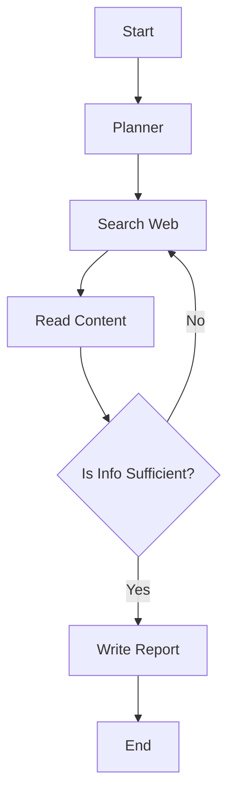

# Building a Research Agent

> **The Deep Researcher** - Search, Read, Summarize, Write

---

## 🕵️ The Goal

Build an agent that can:
1.  Take a topic ("Future of Solid State Batteries").
2.  **Plan** search queries.
3.  **Browse** multiple websites.
4.  **Synthesize** information.
5.  **Write** a comprehensive report with citations.

---

## 🛠️ The Stack

- **Brain:** GPT-4o (Large context window).
- **Tools:** `Tavily` (Search API optimized for LLMs), `BeautifulSoup` (Scraping).
- **Framework:** LangGraph (Cyclic graph for research loops).

---

## 🔄 The Workflow (LangGraph)



---

## 💻 Implementation

```python
from langgraph.graph import StateGraph, END
from langchain_community.tools.tavily_search import TavilySearchResults

# 1. Define State
class AgentState(TypedDict):
    task: str
    plan: str
    content: list[str]
    report: str

# 2. Nodes
def planner_node(state):
    # Ask LLM to generate search queries
    return {"plan": llm.invoke(f"Plan research for: {state['task']}")}

def search_node(state):
    tool = TavilySearchResults()
    results = tool.invoke(state['plan'])
    return {"content": [r['content'] for r in results]}

def writer_node(state):
    # Synthesize
    report = llm.invoke(f"Write report based on: {state['content']}")
    return {"report": report}

# 3. Graph
workflow = StateGraph(AgentState)
workflow.add_node("planner", planner_node)
workflow.add_node("search", search_node)
workflow.add_node("writer", writer_node)

workflow.set_entry_point("planner")
workflow.add_edge("planner", "search")
workflow.add_edge("search", "writer")
workflow.add_edge("writer", END)

app = workflow.compile()
```

---

## 🎓 Interview Focus

1.  **Hallucination in Citations?**
    - LLMs love to invent URLs.
    - **Fix:** Force the agent to select citations *only* from the list of URLs it actually visited. Use a post-processing verification step.

2.  **Handling Conflicting Info?**
    - Source A says "X". Source B says "Not X".
    - The agent should report the conflict: "While Source A claims X, Source B disputes this..."

---

**Research Agent: Your personal analyst!**
