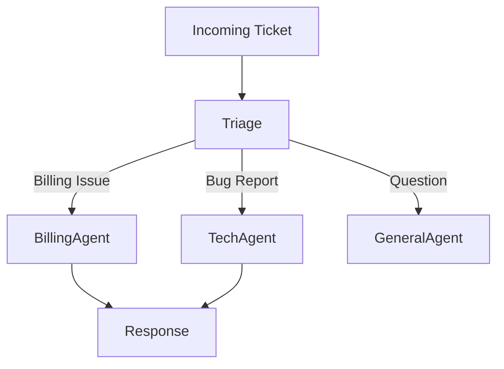

# Customer Support Swarm

> **The Triage Team** - Multi-Agent Orchestration

---

## 📞 The Goal

Handle incoming support tickets automatically.
1.  **Triage Agent:** Classify ticket (Billing, Tech Support, General).
2.  **Billing Agent:** Can refund, check invoice status.
3.  **Tech Agent:** Can debug logs, check server status.

---

## 🏗️ Architecture (Router)



---

## 💻 Implementation (CrewAI)

```python
from crewai import Agent, Task, Crew

# 1. Agents
triage_agent = Agent(
    role="Triage Specialist",
    goal="Classify tickets and assign to correct department.",
    backstory="You are the front-line support manager."
)

billing_agent = Agent(
    role="Billing Specialist",
    goal="Resolve payment issues.",
    tools=[stripe_tool]
)

# 2. Task
ticket = "I was charged twice for my subscription."

classify_task = Task(
    description=f"Classify this ticket: '{ticket}'",
    agent=triage_agent
)

resolve_task = Task(
    description="Resolve the issue based on classification.",
    context=[classify_task], # Wait for classification
    agent=billing_agent # In a real app, we'd dynamically assign this
)

# 3. Crew
crew = Crew(agents=[triage_agent, billing_agent], tasks=[classify_task, resolve_task])
crew.kickoff()
```

---

## 🎓 Interview Focus

1.  **Handoffs?**
    - How does the Triage Agent pass data to the Billing Agent?
    - In CrewAI, the `context` parameter passes the output of Task A to Task B.
    - In OpenAI Assistants, you can pass the `Thread` ID.

2.  **Escalation?**
    - If the Tech Agent fails to solve it, it should have a tool `escalate_to_human()`.

---

**Support Swarm: 24/7 Customer Service!**
